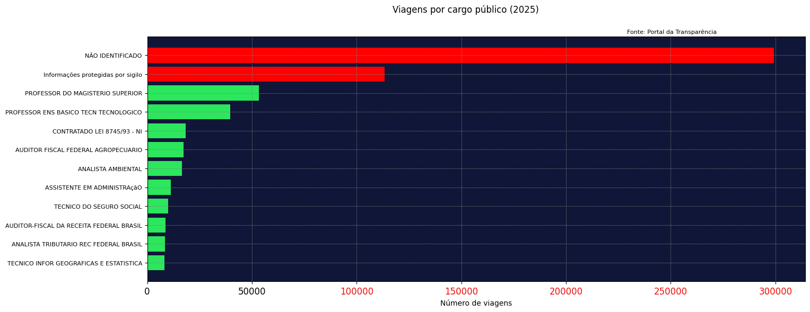
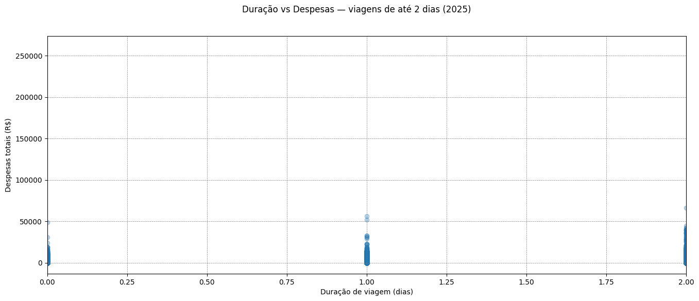

# Análise de Viagens — Portal da Transparência (2025)

Análise exploratória dos dados públicos de viagens a serviço do governo federal brasileiro, com foco na identificação de padrões de gastos por cargo e detecção de outliers — viagens de curta duração com despesas elevadas.

---

## ❓ Pergunta investigativa

> **Existem viagens com gastos atipicamente altos para uma duração muito curta? O que elas têm em comum?**

---

## Visualizações

### Viagens por cargo público



> Cargos com mais de 100.000 viagens estão destacados em vermelho. A categoria "NÃO IDENTIFICADO" lidera com cerca de 300.000 viagens, seguida de "Informações protegidas por sigilo" com aproximadamente 115.000 — o que por si só levanta questionamentos sobre transparência nos dados.

---

### Duração vs Despesas totais — viagens de até 2 dias



> A maioria das viagens curtas tem despesas abaixo de R$ 10.000. Dois pontos se destacam acima de R$ 50.000 com duração de apenas 1 dia — os outliers investigados.

---

## 🔍 Achados principais

### 1. Concentração de viagens sem identificação de cargo
Cerca de **300.000 viagens** (o maior grupo) estão categorizadas como "NÃO IDENTIFICADO", e outras ~115.000 como "Informações protegidas por sigilo". Isso representa uma limitação relevante na rastreabilidade dos gastos públicos.

### 2. Outliers detectados — viagens caras e curtas
Aplicando filtros de despesas acima de R$ 50.000 e duração inferior a 1,25 dias, foram identificadas **2 viagens suspeitas**:

| ID do Processo | Órgão | Situação de Urgência | Justificativa |
|---|---|---|---|
| 20961803 | Presidência da República | ✅ Urgente | Retorno do servidor à sua SEDE |
| 21426671 | Ministério da Fazenda | ✅ Urgente | Não foi possível atender à exigência de prazo |

### 3. Conclusão
Ambas as viagens foram classificadas como **urgentes**, o que explica o custo elevado — passagens adquiridas de última hora tendem a ser significativamente mais caras. Não há evidência de irregularidade, mas o padrão justifica monitoramento contínuo.

---

## Tecnologias utilizadas

- Python 3
- Pandas — leitura, limpeza e agregação dos dados
- Matplotlib — visualizações
- Google Colab — ambiente de execução

---

## Estrutura do projeto

```
├── AnaliseDados.ipynb        # Notebook principal com toda a análise
├── grafico_2025.png          # Gráfico de barras — viagens por cargo
├── scatter_2025.png          # Scatter — duração vs despesas
├── output/
│   └── tabela_2025.xlsx      # Tabela consolidada por cargo exportada
└── README.md
```

---

## 🗂️ Fonte dos dados

- [Portal da Transparência — Viagens a serviço](https://portaldatransparencia.gov.br/download-de-dados/viagens)
- Dados públicos, domínio do governo federal brasileiro
- Período analisado: 2025

---

## 👤 Autor

**Samuel Archila**
Estudante de Data Science | Python | SQL | Power BI | Exército Brasileiro
[LinkedIn](https://www.linkedin.com/in/samuel-archila)
